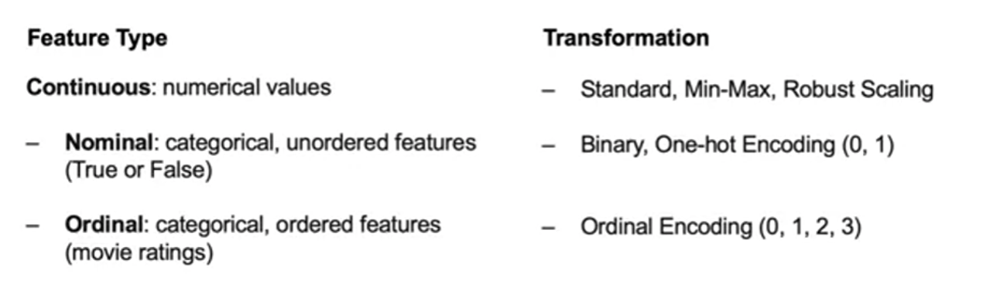

# Exploratory Data Analysis for Machine Learning

## Table of Contents
- [Exploratory Data Analysis for Machine Learning](#exploratory-data-analysis-for-machine-learning)
  - [Table of Contents](#table-of-contents)
  - [Machine Learning and Deep learning](#machine-learning-and-deep-learning)
    - [Supervised Learning:](#supervised-learning)
    - [Unsupervised Learning:](#unsupervised-learning)
    - [Deep Learning:](#deep-learning)
  - [Module 2](#module-2)
    - [Retrieving Data from CSV and JSON Files](#retrieving-data-from-csv-and-json-files)
    - [SQL Databases](#sql-databases)
    - [NoSQL Databases](#nosql-databases)
    - [Data Cleaning](#data-cleaning)
    - [Handling Missing Values and Outliers](#handling-missing-values-and-outliers)
    - [Outliers](#outliers)
  - [Introduction to Exploratory Data Analysis (EDA)](#introduction-to-exploratory-data-analysis-eda)
    - [Techniques for EDA](#techniques-for-eda)
    - [Sampling from DataFrames](#sampling-from-dataframes)
    - [Visualization libraries](#visualization-libraries)
    - [Grouping data for EDA](#grouping-data-for-eda)
  - [Feature Engineering and Variable Transformation](#feature-engineering-and-variable-transformation)
    - [Feature encoding](#feature-encoding)
    - [Feature Scaling](#feature-scaling)
  - [Estimation and Inference, and Hypothesis Testing](#estimation-and-inference-and-hypothesis-testing)
    - [Estimation](#estimation)
    - [Inference](#inference)


## Machine Learning and Deep learning

### Supervised Learning: 
- has a target column. 
- Make Predictions on unseen data.
- Classification: Predicting a category.

### Unsupervised Learning:
- No target column.
- Find structure in the data
- Clustering: Grouping similar data points together.

### Deep Learning:
- Computer vision
- NLP

**Machine Learning Workflow:**

- Problem Statement: What problem are you trying to solve?
- Data Collection: Collect data from various sources.
- Data exploration and Preprocessing: how should you clean the data so your model can use it.
- Modeling: Build a model to solve the problem.
- Validation: Did I solve the problem? How well does the model perform?
- Decision making and deployment: communicate the results to stakeholders. Put the model into production.


This is a summary of the common taxonomy for data in open source packages for Machine Learning:

- target: category or value you are trying to predict
- features: explanatory variables used for prediction
- example: an observation or single data point within the data
- label: the value of the target for a single data point

## Module 2

### Retrieving Data from CSV and JSON Files

Read the data from a CSV file:

```python
import pandas as pd

df = pd.read_csv('data.csv')
```

```python
data = pd.read_json('data.json')

data.to_json('data.json')
```


### SQL Databases

Example of SQL database:

- PostgreSQL
- MySQL
- Microsoft SQL Server
- AWS Redshift

```python
import sqlite3
import pandas as pd

# Initialize path to database
path_to_db = 'data.db'

# Connect to the database
connection = sqlite3.connect(path_to_db)

# Read data from the database
df = pd.read_sql('SELECT * FROM data', connection)

```


### NoSQL Databases

NoSQL databases are not based on tables, vary more in structure.

Most NoSQL databases are document-oriented, meaning that they store data in a format that is more flexible than the tabular format of SQL databases.

Most NoSQL databases store data in JSON format.

Example of NoSQL databases:

- Document databases: MongoDB, CouchDB
- Key-value databases: Redis, Amazon DynamoDB
- Wide-column stores: Cassandra, Amazon DynamoDB
- Graph databases: Neo4j

```python
import pymongo

# Create a client to connect to the database
client = pymongo.MongoClient()

# Choose a database
db = client.database_name

# Create a cursor object using a query
cursor = db.collection_name.find(query)

# expand cursor and construct a dataframe
df = pd.DataFrame(list(cursor))

# Iterate over the cursor
for document in cursor:
    print(document)
```

### Data Cleaning

Why is data cleaning important?

- Data is often messy and incomplete.
- Data cleaning is the process of preparing data for analysis.
- Data cleaning is a crucial step in the data science workflow.

How can data be Messy?

- Missing values
- **Duplicate values**
- **Inconsistent values**
- Incorrect values
- Outliers


### Handling Missing Values and Outliers

Remove entire row or column:

```
# Drop rows with missing values
df.dropna(inplace=True)

# Drop rows with missing values in specific columns
df.dropna(subset=['column_name'], inplace=True)

# Drop columns with missing values
df.dropna(axis=1, inplace=True)
```

Imputing missing values:

```python
# Fill missing values with the mean of the column
df['column_name'].fillna(df['column_name'].mean(), inplace=True)
```

### Outliers

Police for outliers:

- Remove outliers
- Replace outliers
- Transform outliers


## Introduction to Exploratory Data Analysis (EDA)

EDA is the process of exploring data to understand it.

Why is EDA important?

EDA allows you to understand the data and identify patterns and relationships.

EDA allows you to identify outliers and missing values.

EDA allows you to identify the best features to use for modeling.

### Techniques for EDA

- **Descriptive statistics**: Average, median, mode, standard deviation, etc.
- Data **visualization**: Histograms, scatter plots, box plots, etc.
- Feature engineering: Creating new features from existing features.
- Correlation analysis: Identifying relationships between features.
- Hypothesis testing: Testing whether a hypothesis is true or false.
- Model building: Building a model to predict the target.


### Sampling from DataFrames

```python
# Sample 5 rows from the DataFrame
df.sample(n=5)

# Sample 50% of the rows from the DataFrame
df.sample(frac=0.5)
```

### Visualization libraries

- Matplotlib
- pandas
- seaborn: statistical data visualization

### Grouping data for EDA


## Feature Engineering and Variable Transformation

An example of linear regression:

$y_\beta(x) = \beta_0 + \beta_1x_1 + \beta_2x_2 + ... + \beta_nx_n$

Here $\beta$ is the coefficient and $x$ is the feature.

Predictions from linear regression models assume residuals are **normally distributed.**

However, this is not always the case.

**Data transformation** is the process of transforming data to meet the assumptions of the model.

**Log transformation** is a common technique for transforming data to meet the assumptions of the model.

$y_\beta(x) = \beta_0 + \beta_1\log(x_1) + \beta_2\log(x_2) + ... + \beta_n\log(x_n)$

**Polynomial transformation** is a technique for transforming data to meet the assumptions of the model.

$y_\beta(x) = \beta_0 + \beta_1x_1 + \beta_2x_2^2 + ... + \beta_nx_n^n$

**Box-Cox transformation** is a technique for transforming data to meet the assumptions of the model.

$y_\beta(x) = \beta_0 + \beta_1x_1 + \beta_2x_2 + ... + \beta_nx_n$


### Feature encoding

- Binary encoding: convert variables to either 0 or 1.
- One-hot encoding: convert variables to multiple columns. one for each category. This creates several new variables.
- Ordinal encoding: convert variables to a range of numbers.


### Feature Scaling

Adjusting the scale of the data to meet the assumptions of the model.

Different continuous variables have different scales.

- standard scaling: scale the data to have a mean of 0 and a standard deviation of 1.
- min-max scaling: scale the data to have a minimum of 0 and a maximum of 1. Sensitivity to outliers.
- robust scaling: maps the data to the 25th and 75th percentiles to 0 and 1. This means the variable itself may outside the range of 0 and 1.




## Estimation and Inference, and Hypothesis Testing

### Estimation

$\bar{X} = \frac{1}{N}\sum_{i=1}^N x_i$

### Inference

putting an accuracy on the estimate.

Standard error:

$sqrt(\sum(x_i - \bar{X})^2 / (N-1))$

