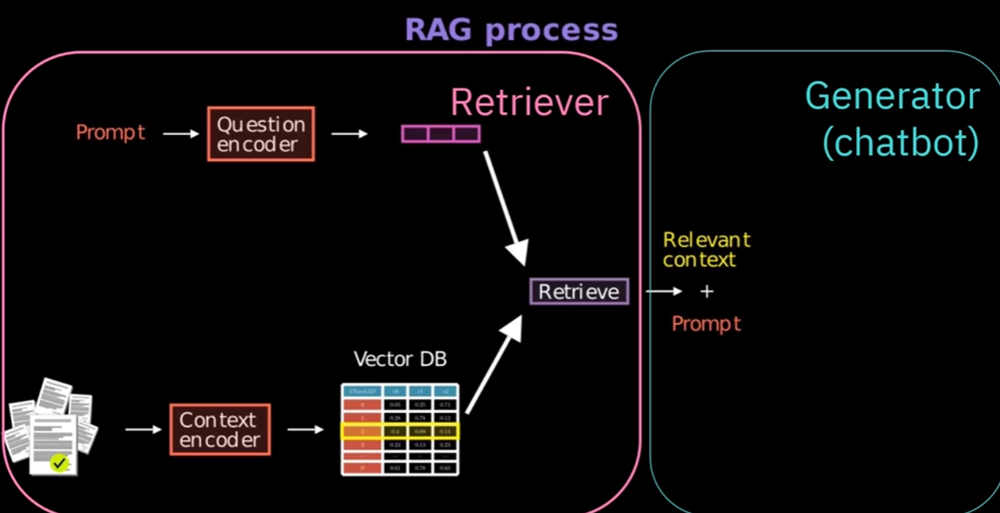

# AI Agents Using RAG and LangChain

## Table of Contents

- [AI Agents Using RAG and LangChain](#ai-agents-using-rag-and-langchain)
  - [Table of Contents](#table-of-contents)
  - [Introduction](#introduction)
  - [RAG](#rag)

## Introduction

## RAG

AI framework for optimizing the retrieval of information from a large corpus of data.

LLM perform well on general tasks.

RAG can add relevant knowledge to the LLM.

E.g.

what is the company's mobile policy?

Answer: Unfortunatly, I don't have access to the company's mobile policy.

